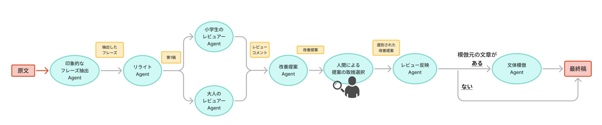

# litrature-to-easy-reading

## 概要
文学作品（中学・高校教科書に載っている短編作品を想定）を小学校1-2年生向けにリライトする際のマルチエージェントの試作です。

## 資料
📌 PyCon mini 東海 2025で発表しました   
個人ではじめるマルチAIエージェント入門 〜LangChain × LangGraphでアイデアを形にするステップ〜

- 発表概要: https://tokai.pycon.jp/2025/#session-talk-2
- スライド: https://speakerdeck.com/komofr/pyconminitokai2025

## 出力サンプル
[output_samples](https://github.com/komo-fr/easy-literature-agents/output_samples)フォルダに、出力結果のサンプルを置いています。

## エージェントの構成



プログラムは以下のエージェント/処理で構成されています：

| エージェント/処理 | 説明 |
|:---|:---|
| 印象的なフレーズ抽出Agent | 高校生の視点で原文から印象的なフレーズを抽出する<br>  |
| Webからの印象的なフレーズ抽出Agent | Webを検索して、対象の作品の名言・名台詞など有名なフレーズを抽出する<br> |
| リライトAgent| 原文を小学1-2年生向けの文章にリライトする<br>※ 前段で抽出した「印象的なフレーズ」は残すようにリライトする |
| 小学生のレビュアーAgent | 難しい言葉、長い文、わかりにくい部分を指摘  | 
| 大人のレビュアーAgent | 原作の本質やメッセージが維持されているかを評価 | 
| 改善提案Agent | 各レビュアーのフィードバックを基に具体的な改善案を提案<br>提案には優先度（MUST/Should/May/nits）を付与 |
| 人間による提案の取捨選択 | Human-in-the-loop / エージェントの処理を一旦中断し、前段のエージェントが出力した改善提案を、人間によって手動で取捨選択する |
| レビュー反映Agent |  改善提案を反映して文章を調整 |
| 文体模倣Agent | 指定されたファイルの文体を模倣して再度リライトする<br>模倣元の文体を入力された時のみ実行される |

## 環境構築

1. 依存パッケージのインストール
```bash
pip install -r requirements.txt
```

2. 環境変数の設定
`.env`ファイルを作成し、以下の内容を設定：
```
OPENAI_API_KEY={OpenAIのAPIキー}
TAVILY_API_KEY={TavilyのAPIキー}
LANGSMITH_TRACING=true
LANGSMITH_ENDPOINT="https://api.smith.langchain.com"
LANGSMITH_API_KEY={LangSmithのAPIキー}
LANGSMITH_PROJECT={LangSmithで使う任意のプロジェクト名}
```

## コマンドの実行

```bash
$ python main.py {入力となるテキストファイル.txt} --model {使用するモデル名}
```

入力例:
```bash
python main.py input_samples/sangetsuki.txt --model gpt-4.1
```

※ `--model`が未指定の場合は、対話形式でモデル名を選択できます。

文体を模倣する場合は、以下のように指定します。

```bash
$ python main.py {入力となるテキストファイル.txt} --style {模倣元のテキストファイル.txt}
```

入力例:
```
python main.py input_samples/sangetsuki.txt --style input_samples/kumonoito.txt
```

## 入力データ
サンプルとして、`input_samples`フォルダに青空文庫の著作権切れのファイルを用意しています。
（ `テキストファイル(ルビあり)` のzipファイル内にあるテキストをUTF-8に変換して配置）

| ファイル名 | 著者名/作品名 | 元ファイルの配布URL |
|:---|:---|:---|
| `sangetsuki.txt` | 中島 敦　「山月記」 | https://www.aozora.gr.jp/cards/000119/card624.html |
| `rashomon.txt` | 芥川 龍之介「羅生門」 | https://www.aozora.gr.jp/cards/000879/card127.html |
| `takasebune.txt` | 森 鴎外「高瀬舟」 | https://www.aozora.gr.jp/cards/000129/card45245.html |
| `kumonoito.txt` | 芥川 龍之介「蜘蛛の糸」 | https://www.aozora.gr.jp/cards/000879/files/92_14545.html |

## 出力結果
各エージェントの出力結果などはLangSmith上で確認できます。   
ローカルの `output`ディレクトリには、以下のファイルが生成されます：

1. `output.txt`
   - すべてのデータを人間が読みやすい形式で保存
     - 第1稿（リライトされた文章）
     - 各エージェントからのフィードバック
     - 第2稿（改善提案を反映）
     - 最終稿（文体統一後）

2. `output.json`
   - すべてのデータをJSON形式で保存

3. `draft1.txt`
   - 第1稿のみ

4. `draft2.txt`
   - 第2稿のみ
   - ※ 第1稿と第2稿のdiffを確認すると、レビュアーエージェントや改善提案エージェントの効果がわかりやすいです

5. `draft3.txt`
   - 最終稿のみ
   - ※ 文体模倣をしない場合、第2稿と最終稿は同じ内容になります

6. `logs/output_[timestamp].json`
   - 実行時のログをタイムスタンプ付きで保存
